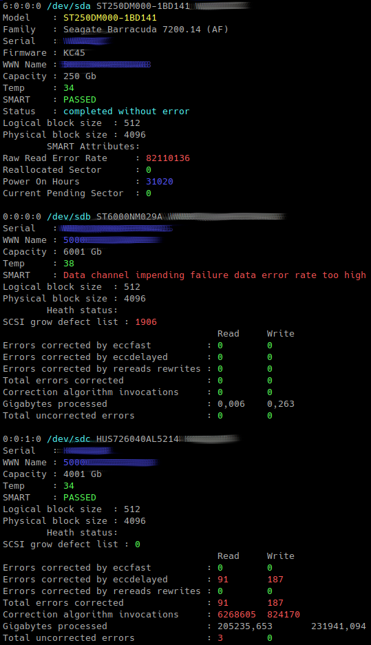
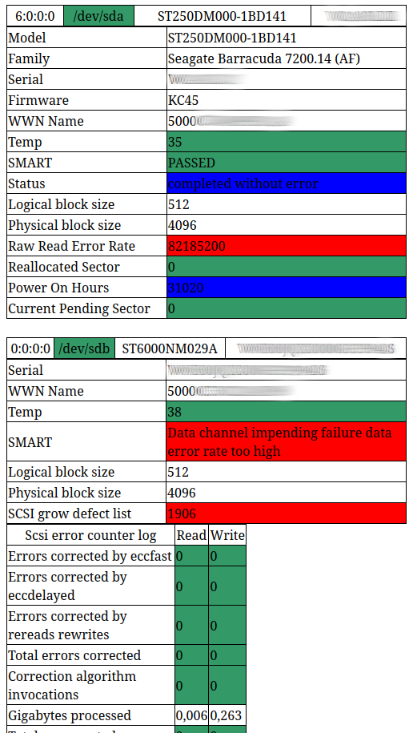

# smartctl_info
# Get SMART info from disks.

* Tool get S.M.A.R.T. info from 'smartctl' program.
* Tool run without params.
* Tool create '/tmp/smart_info.lock' to simple prevents to run second copy of script.
* Tool must run from 'root' user.
* Tool may send report to email. Need to change:
```
        mail_send   = False # or True
        mail_from   = "report@example.lan"
        mail_to     = "user1@example.lan"
        mail_sub    = "smartctl report from " + from_host
        mail_server = "smtp.example.lan"
        mail_s_port = 25 # or 587
        #mail_user  = ""
        #mail_pass  = ""
        
        and
        
        #mail.ehlo()
        #mail.starttls()
        #mail.login(mail_user, mail_pass)
```

# Examples


