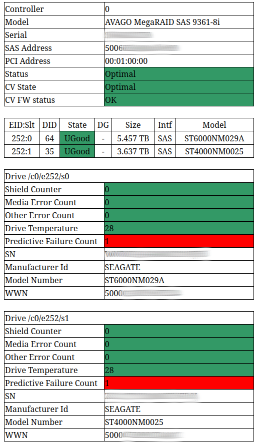
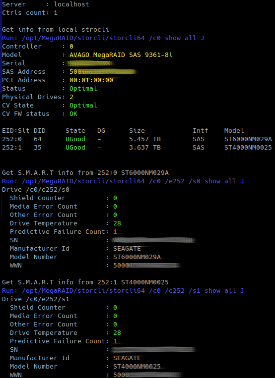
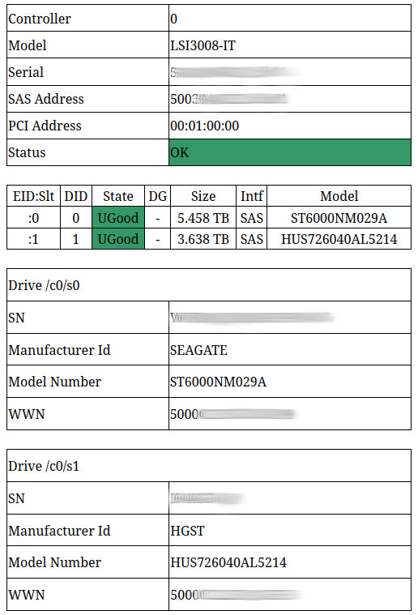
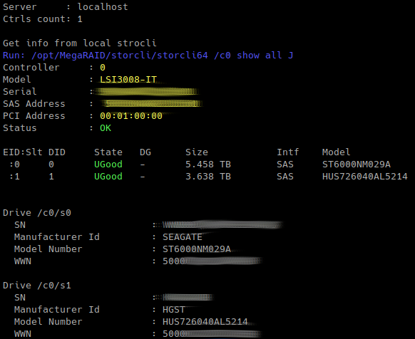

# storcli_info
# Get disks health/state info from storcli tool.

* Tool used 'stocli' program. Storcli must be installed.
* Tool tested on AVAGO MegaRaid SAS 9361-8i, LSI3008-IT adapters.
* Tool may connect to another system and take info from remote system (where installed storcli, Linux, Esxi ...) via ssh key for example.
* Tool may send report to email. It remember state of error via 'alarm_tmp_file'. You may use scheduler.
* Tool may use params:
```
        -s, --server
                    Hostname or IP, default=localhost
        -c, --count
                    Controllers count (If you know in advance), default=1
        -p, --path
                    storcli path, default=/opt/MegaRAID/storcli/storcli64
        -m, --mail
                    Send report 0 or 1, default=0
```
# Usage
```
Exmample: ./storcli_info.py -s server01.local -c 1 -p /opt/lsi/storcli/storcli -m 1
Exmample: ./storcli_info.py -m 1
Exmample: ./storcli_info.py -c 2 -m 0
```

# Examples





# Abbreviations of storcli
```
EID     : Enclosure Device ID
Slt     : Slot No.
DID     : Device ID
DG      : DriveGroup
DHS     : Dedicated Hot Spare
UGood   : Unconfigured Good
GHS     : Global Hotspare
UBad    : Unconfigured Bad
Onln    : Online
Offln   : Offline
Intf    : Interface
Med     : Media Type
SED     : Self Encryptive Drive
PI      : Protection Info
SeSz    : Sector Size
Sp      : Spun
U       : Up
D       : Down
T       : Transition
F       : Foreign
UGUnsp  : Unsupported
UGShld  : UnConfigured shielded
HSPShld : Hotspare shielded
CFShld  : Configured shielded
Cpybck  : CopyBack
CBShld  : Copyback Shielded
UBUnsp  : UBad Unsupported
```
