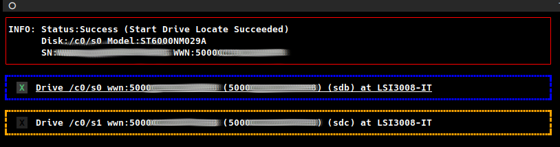
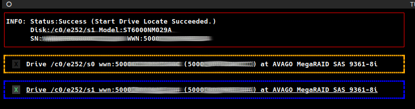

# storcli_locator
# TUI for storcli to locate disks.

* Tool used 'stocli' program. Storcli must be installed.
* Tool tested on AVAGO MegaRaid SAS 9361-8i, LSI3008-IT adapters.
* Tool run without params.
* Tool must run from 'root' user.
* Tool used 'textual' extension for python 3:
```
    pip3 install textual
```


# Examples


